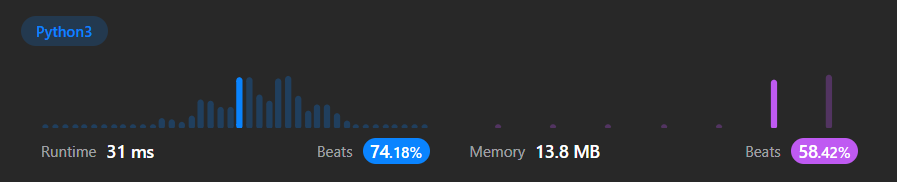

# 20. Valid Parentheses

## Problem Description
Given a string  `s`  containing just the characters  `'('`,  `')'`,  `'{'`,  `'}'`,  `'['`  and  `']'`, determine if the input string is valid.

An input string is valid if:

1.  Open brackets must be closed by the same type of brackets.
2.  Open brackets must be closed in the correct order.
3.  Every close bracket has a corresponding open bracket of the same type.
---
**Example 1:**

**Input:** s = "()"

**Output:** true

---
**Example 2:**

**Input:** s = "()[]{}"

**Output:** true

---
**Example 3:**

**Input:** s = "(]"

**Output:** false

---
**Constraints:**

-   `1 <= s.length <= 104`
-   `s`  consists of parentheses only  `'()[]{}'`.

## Approach
A stack will be used to keep track of the open parentheses. On encounter with a closing parentheses, the top of the stack will be checked to see if the pair matches. In the case that the stack is empty or they do not match up, return `False`. After traversing the string, if the stack is not empty, there is an unclosed set, so return `False`. Keep in mind nested stack must be handled.

```
Pseudocode :

START
	Initialise stack
	FOR character IN input
		IF character is open parentheses
			add character to stack
		ELSE
			IF stack is empty OR unmatched pair
				RETURN False
			ELSE
				pop top of stack
	IF stack is not empty
		RETURN False
	ELSE
		RETURN True
END
```

## Solution Benchmark
