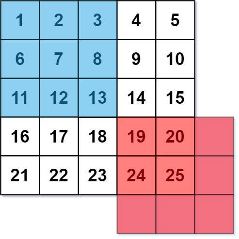

# 661. Image Smoother

## Problem Description

Given a `m`\*`n` grid of integers, apply an `image smoothing filter` on the the grid. Consider the following example:

For the pixel that holds the value 7 to be smoothed, it needs to be the average of the values in the blue 3x3 grid, so the value should be `(1 + 2 + 3 + 6 + 7 + 8 + 11 + 12 + 13) // 9`, giving the final answer of `7`.

For the pixel that holds the value 25 to be smoothed, it needs to be the average of the values in the red 3x3 grid. Obviously, only the values that are currently present in the original image grid only needs to be considered. So, the value should be `(19 + 20 + 24 + 25) // 4`, giving the final answer of `22`.

---

**Constraints:**

- `m == img.length`
- `n == img[i].length`
- `1 <= m, n <= 200`
- `0 <= img[i][j] <= 255`

## Approach

For every element, use for loops with clamps to protect against flowing out of the original grid. These clamps will help iterate through only the elements that are necessary, and so keeping track of the total and the element count will be easy. A new grid to represent the smoothed image is necessary, since we will need the original values multiple times.
