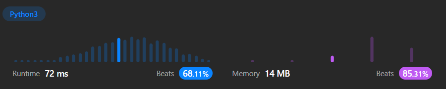

# 946. Validate Stack Sequences

## Problem Description
Given two integer arrays  `pushed`  and  `popped`  each with distinct values, return  `true` _if this could have been the result of a sequence of push and pop operations on an initially empty stack, or_ `false` _otherwise._

---

**Example 1:**

**Input:** pushed = [1,2,3,4,5], popped = [4,5,3,2,1]

**Output:** true

**Explanation:** We might do the following sequence:
push(1), push(2), push(3), push(4),
pop() -> 4,
push(5),
pop() -> 5, pop() -> 3, pop() -> 2, pop() -> 1

---

**Example 2:**

**Input:** pushed = [1,2,3,4,5], popped = [4,3,5,1,2]

**Output:** false

**Explanation:** 1 cannot be popped before 2.
 
---

**Constraints:**
-   `1 <= pushed.length <= 1000`
-   `0 <= pushed[i] <= 1000`
-   All the elements of  `pushed`  are  **unique**.
-   `popped.length == pushed.length`
-   `popped`  is a permutation of  `pushed`.
  

## Approach

A stack will be used as the model for the elements to be pushed and popped. Traverse the `pushed` array and push the elements to the stack. At the same time, check if the element is to be popped. After all elements of `pushed` are added to the stack, the only correct answer is if what is remaining in the `popped` array is the opposite of what is currently in the stack.

```
Pseudocode :

START
	Initialise stack
	FOR item IN pushed
		add item to stack
		WHILE top of stack == popped[0]
			remove top of stack and popped[0]
	IF stack == reversed popped
		RETURN True
	ELSE
		RETURN False
END
```

## Solution Benchmark

